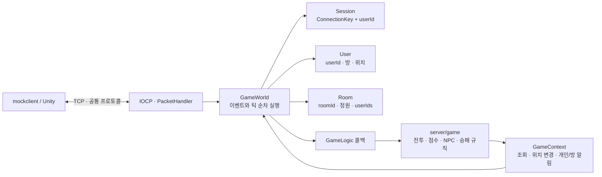
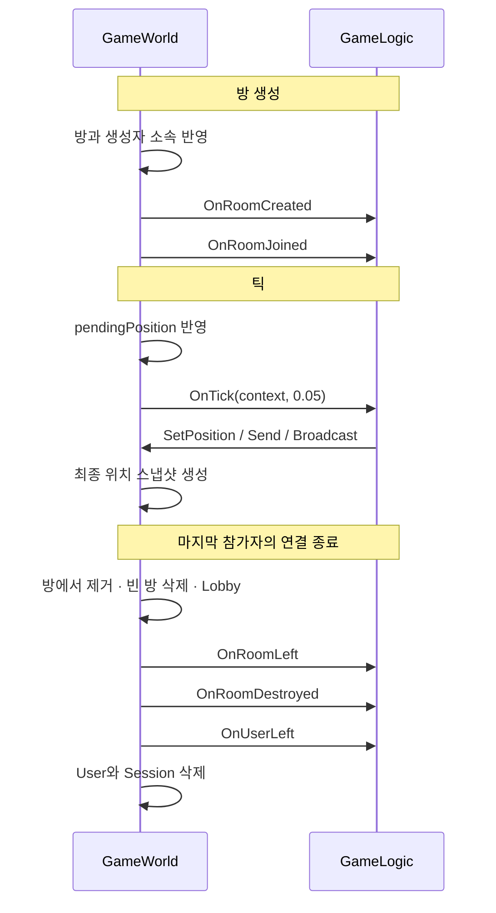

# 게임 로직 개발 가이드

서버의 게임 규칙은 **`server/game`**에서 작성합니다. 연결 관리, 패킷 조립, 사용자·방 수명, 요청·응답 대응, 20Hz 틱, 위치 스냅샷 전송은 공통 서버가 담당합니다. 실행 프로그램에는 [ExampleGame](../server/game/ExampleGame.cpp)이 연결되어 있으며, 이 예제를 수정하거나 `GameLogic`을 상속한 다른 클래스로 교체하면 됩니다.

## 구조



`Session`은 TCP 연결 시 생성되고 입장 전에는 `userId=0`입니다. `Enter`가 성공하면 별도의 `User`를 만들고 세션과 연결합니다. `User`는 `Lobby` 또는 `InRoom` 상태입니다. 네트워크의 슬롯 번호·세대는 사용자 ID와 별개입니다.

기존 프로토콜의 `player_id`는 C++의 `User.userId`와 같은 값입니다. 기존 Unity 통신과 호환되도록 필드 이름·번호는 유지했습니다. 방 참가자는 `Room.userIds`로 조회합니다. HP, 스킬, 인벤토리, 몬스터 등의 게임 전용 데이터는 게임 클래스 내부에서 userId·roomId를 키로 관리하세요.

## 게임 파일을 바꾸는 방법

| 파일 | 수정할 내용 |
|---|---|
| [ExampleGame.hpp](../server/game/ExampleGame.hpp) | 게임 전용 데이터와 사용할 콜백 선언 |
| [ExampleGame.cpp](../server/game/ExampleGame.cpp) | 명령 검사, 게임 상태 변경, 틱 시뮬레이션 |
| [main.cpp](../server/src/main.cpp) | 다른 게임 클래스로 교체할 때 생성 팩터리 변경 |
| [server/CMakeLists.txt](../server/CMakeLists.txt) | 게임 구현 파일을 추가할 때 `example_game` 대상에 등록 |
| [game.proto](../common/proto/game.proto) | 기본 명령·이벤트 전달 형식. 새 명령 번호마다 수정할 필요 없음 |

현재 연결 코드는 다음과 같습니다.

```cpp
ZPDServer server([] { return std::make_unique<ExampleGame>(); });
```

서버별로 게임 인스턴스 하나를 만듭니다. 같은 인스턴스가 여러 방을 관리하므로 방별 상태는 roomId로 구분하세요. Stop 시 게임 인스턴스도 폐기하고, 재시작 후 첫 연결에서 팩터리로 새로 생성합니다. 게임 객체 생성과 콜백 실행은 로직 스레드에서 수행합니다.

## 콜백

정의: [GameLogic.hpp](../server/include/GameLogic.hpp). 필요한 함수만 재정의하면 됩니다.

| 콜백 | 호출 시점 | 사용 예 |
|---|---|---|
| `OnUserEntered` | 입장 성공, User·연결 인덱스 등록 후 | 사용자 게임 데이터 생성 |
| `OnRoomCreated` | 방 생성 완료 후 | 라운드·맵·몬스터 초기화 |
| `OnRoomJoined` | 방과 사용자 소속 반영 후. 생성자에게도 호출 | 스폰 위치 설정, 초기 상태 알림 |
| `OnRoomLeft` | 방 참가자에서 제거하고 사용자를 Lobby로 바꾼 후 | 해당 방의 사용자 게임 데이터 정리 |
| `OnRoomDestroyed` | 마지막 참가자 퇴장으로 방 삭제 후 | 방 전용 데이터 정리 |
| `OnUserLeft` | 연결 종료 시 방 정리 후, User 삭제 직전 | 사용자 게임 데이터 삭제 |
| `AcceptPosition` | 공통 좌표·소속 검사 통과 후, 대기 위치 반영 전 | 이동 허용 여부 결정. false는 InvalidState |
| `OnCommand` | 입장·현재 방·명령 형식 검사 통과 후 | 공격, 아이템 사용, 준비 상태 등 |
| `OnTick` | 대기 위치 반영 후, 위치 스냅샷 생성 전 | 이동·전투·NPC·타이머 갱신 |

게임 콜백은 같은 로직 스레드에서 직렬로 실행됩니다. 콜백에서 네트워크 수신, 파일·DB 요청, 긴 대기 작업을 동기 실행하면 전체 방과 틱이 지연됩니다. 외부 비동기 결과를 로직 스레드에 전달하는 전용 API는 현재 제공하지 않습니다.



Stop은 전체 상태 폐기이며 각 사용자·방의 퇴장 콜백을 개별 실행하지 않습니다. 게임이 가진 자원은 소멸자로 정리해야 합니다. `OnTick`의 deltaSeconds는 고정 시뮬레이션 간격 0.05초이며, 지연으로 건너뛴 실제 시간까지 보상하지 않습니다.

## GameContext 사용

정의: [GameContext.hpp](../server/include/GameContext.hpp).

| API | 동작 |
|---|---|
| `FindUser(id)`, `FindRoom(id)` | 읽기 전용 포인터. 없으면 nullptr |
| `Users()`, `Rooms()` | 읽기 전용 맵으로 순회 |
| `TickNumber()` | 현재 서버 틱 번호 |
| `SetPosition(userId, {x,y,z})` | 방 참가자의 위치 변경과 대기 위치 해제. 없는 사용자·로비·잘못된 좌표는 false |
| `Send(userId, event, payload)` | 개인에게 GameEvent 전송 예약. room_id는 해당 사용자의 현재 방, 로비면 0 |
| `Broadcast(roomId, event, payload)` | 해당 방의 전체 참가자에게 GameEvent 전송 예약 |

event 번호는 0 이외, payload는 최대 4000바이트입니다. 없는 대상이나 잘못된 인자는 false를 반환합니다. 전송 예약 성공은 실제 수신 확인이 아닙니다. Context와 조회한 포인터·참조는 콜백 밖에 저장하거나 다른 스레드에서 사용하지 마세요. 사용자 ID·방 소속·참가자 목록은 공통 서버가 관리하며 게임에서 직접 변경하지 않습니다.

서버가 직접 이동을 계산하려면 `AcceptPosition`에서 클라이언트의 절대 위치 제출을 거절하고, `OnCommand`로 이동 입력을 받아 `OnTick`에서 위치를 계산한 뒤 `SetPosition`을 호출하면 됩니다. 이때 별도의 스냅샷 전송 코드를 작성할 필요가 없습니다.

## 사용자 정의 명령과 이벤트

| 10진수 코드 | 메시지 | 본문 |
|---|---|---|
| 9 | GameCommandRequest | room_id, command, bytes payload |
| 137 | GameCommandResponse | bytes payload |
| 197 | GameEvent | room_id, event, bytes payload |

명령 번호와 payload 의미는 게임에서 정의합니다. `OnCommand`는 `GameReply{error, payload}`를 반환합니다. 요청자의 사용자 ID는 서버 세션에서 결정하므로 payload에서 임의로 지정한 사용자 ID를 자신의 신원으로 신뢰하면 안 됩니다.

성공 응답에는 원래 requestId를 사용합니다. 알림은 requestId=0입니다. 명령 응답을 먼저 송신 예약하고 그 명령이 만든 이벤트를 뒤에 예약합니다. payload는 바이너리이므로 게임별 Protobuf 메시지를 직렬화해서 넣을 수도 있습니다. 그 경우 서버·Unity에서 동일한 게임별 스키마를 생성하고 CMake의 protocol 대상에도 등록하세요.

## 실행 가능한 예제

ExampleGame은 방 참가 시 개인 점수를 0으로 시작합니다. 틱마다 방의 시뮬레이션 시간을 누적합니다.

| mockclient 명령 | 예제 동작 |
|---|---|
| `/game 1` | 내 점수 1 증가, 응답에 현재 점수, 방 전체에 이벤트 1로 `userId score` 전달 |
| `/game 2` | 내 점수 조회 |
| `/game 3` | 현재 방의 시뮬레이션 경과 초 조회 |

서버와 클라이언트 두 개를 실행하고, `/enter`와 `/create 2`, `/join 방ID`로 같은 방에 참가한 뒤 `/game 1`을 실행하세요. 두 클라이언트 모두 이벤트를 받고 요청자는 점수 응답도 받습니다. 재참가 시 개인 점수는 초기화됩니다.

이 예제의 payload는 간단한 텍스트입니다. Unity에서도 공통 헤더와 game.proto를 처리하고 명령 번호별 payload를 해석해야 합니다. 게임 화면·입력·애니메이션·UI 구현은 별도 클라이언트 작업입니다.

## 실패 처리와 검증

- 생명주기·틱 콜백 예외는 로그를 남기고 격리합니다. 이미 반영한 방·사용자 상태를 되돌리지 않으며 나머지 종료 정리를 계속합니다.
- 명령 콜백 예외 또는 너무 큰 응답은 UnknownError로 처리합니다. 실패 명령이 예약한 사용자 정의 이벤트는 폐기합니다.
- 콜백이 수정한 자체 게임 데이터와 `SetPosition` 결과는 자동 롤백하지 않습니다. 검증과 결과 준비를 먼저 마친 뒤 상태를 변경하세요.
- 메모리 고갈·프로세스 종료·송신 실패에 대한 영속성과 일괄 전달은 보장하지 않습니다. 인증·저장·재접속 복구는 현재 프레임워크 범위에 포함되어 있지 않습니다.

```powershell
cmake --build --preset debug
ctest --preset debug
python -X utf8 mockclient/tests/chat_client_tests.py
```

`game-extension` 테스트는 콜백 순서, 읽기 전용 조회, 방 알림 격리, 바이너리 payload, 틱 위치 반영, 이동 거절, 예외 격리, 재시작 초기화를 검사합니다. 기존 서버 통합 테스트와 실제 mockclient 테스트도 함께 실행합니다.
