# 서비스 구조 및 트랜잭션 요약

2026-09-16 · 현재 구현 기준 · 다이어그램은 Mermaid 형식

현재 서비스는 **Windows TCP 서버 프로세스 하나**에서 입장, 방 생성·참가·퇴장, 방 채팅과 틱 기반 위치 동기화를 처리합니다. 네트워크 I/O는 여러 워커가 처리하고, 게임 상태는 로직 스레드 하나가 순서대로 변경합니다. 데이터베이스, 외부 인증, 영속 저장소는 연결되어 있지 않습니다.

이 문서에서 **트랜잭션**은 요청 하나 또는 연결 종료 이벤트 하나를 처리하는 논리적 작업 단위입니다. **커밋**은 메모리의 사용자·방 상태에 변경을 반영하는 구간을 뜻합니다. 실제 DB 커밋 명령이나 범용 롤백 기능이 있다는 의미는 아닙니다.

위치 요청은 대기값을 갱신하고, 같은 로직 스레드의 50ms 틱이 위치를 반영합니다. [틱 기반 위치 동기화](틱_기반_위치_동기화.md)에 별도의 처리 시퀀스와 규격을 정리했습니다.

게임별 규칙은 GameLogic 콜백으로 확장합니다. User·Session 분리와 최신 콜백 경계는 [게임 로직 개발 가이드](게임_로직_개발_가이드.md)를 함께 참고하세요.

읽는 순서: [전체 구조](#1-전체-구조) → [상태 모델](#2-상태-모델) → [공통 처리 경계](#3-트랜잭션의-공통-처리-경계) → [요청별 상세](#4-요청별-트랜잭션) → [실패와 보장 범위](#5-실패-처리와-보장-범위).

## 1. 전체 구조

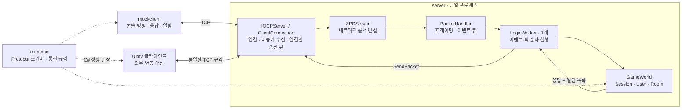

| 디렉터리 | 책임 | 핵심 파일 |
|---|---|---|
| `mockclient` | 개발용 콘솔 클라이언트, 요청 추적, 수신 상태 반영 | [RoomChatClient](../mockclient/include/RoomChatClient.hpp), [수신 처리](../mockclient/src/RoomChatReceiver.cpp) |
| `common` | 메시지 스키마, 패킷 헤더, 코드·한도, 공통 C++ 유틸리티 | [proto](../common/proto), [Packet](../common/include/Packet.hpp), [공유 안내](../common/README.md) |
| `server` | 연결 관리, 이벤트 실행, 세션·방·채팅 처리 | [ZPDServer](../server/include/ZPDServer.hpp), [PacketHandler](../server/src/PacketHandler.cpp), [GameWorld](../server/src/GameWorld.cpp) |

Unity 연동 코드는 이 저장소에 구현되어 있지 않습니다. 공유의 기준은 `.proto`와 통신 규격이며, `common/include`의 C++ 코드를 Unity가 그대로 실행하는 구조는 아닙니다.

### 실행 주체와 잠금

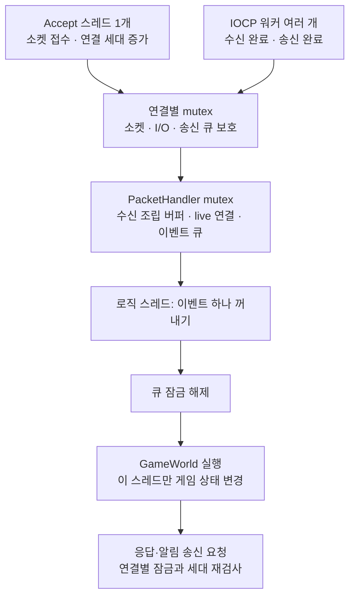

서로 다른 연결의 I/O는 병렬로 진행됩니다. 게임 요청은 **서버 이벤트 큐에 들어간 순서**로 실행하며, 하나의 요청을 처리하는 도중 다른 게임 요청이 끼어들지 않습니다. 서로 다른 클라이언트가 실제로 버튼을 누른 시각까지 정렬하는 것은 아닙니다. `GameWorld` 실행과 송신 콜백 호출 동안에는 큐 mutex를 잡고 있지 않습니다.

## 2. 상태 모델

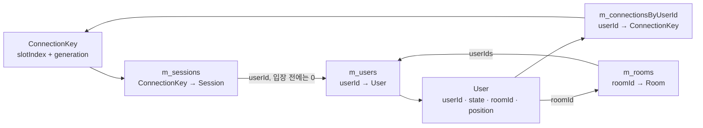

정상적인 이벤트 처리 완료 시 유지해야 하는 관계는 다음과 같습니다.

- 입장 전에는 `Session.userId=0`이며 User는 없습니다. `Enter` 성공 후 임시 ID를 가진 User가 생깁니다.
- `Lobby`: 플레이어 ID와 연결 인덱스는 존재하지만 소속 방은 없습니다.
- `InRoom`: User의 `roomId`가 가리키는 방에 자신의 `playerId`가 포함됩니다.
- 한 플레이어는 한 방에만 속하고, 방 참가자 수는 정원 이하입니다. 마지막 참가자가 나가면 방을 삭제합니다.
- 플레이어 ID는 연결 슬롯과 다릅니다. 재접속은 새 세션이며 기존 플레이어·방 소속을 복구하지 않습니다.

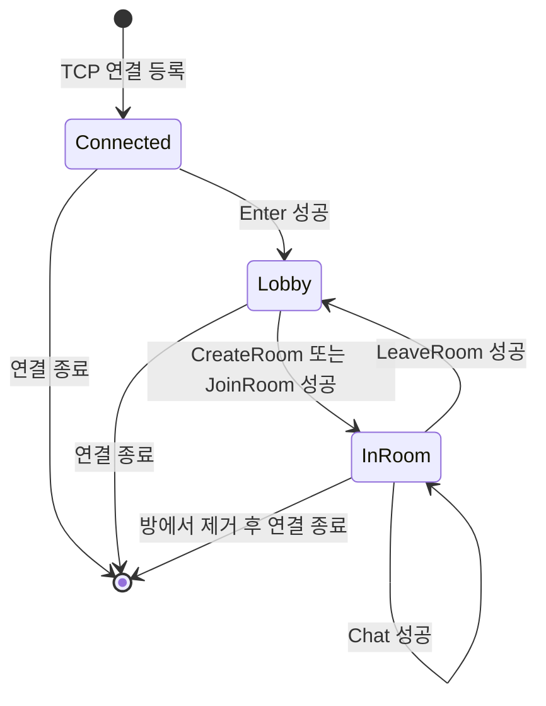

`Enter`는 인증 없이 ID를 발급하는 개발용 입장입니다. 방 상태는 현재 `Waiting` 하나뿐이며, 게임 시작·진행·종료 상태 전이는 아직 없습니다.

## 3. 트랜잭션의 공통 처리 경계

### TCP 바이트에서 요청까지

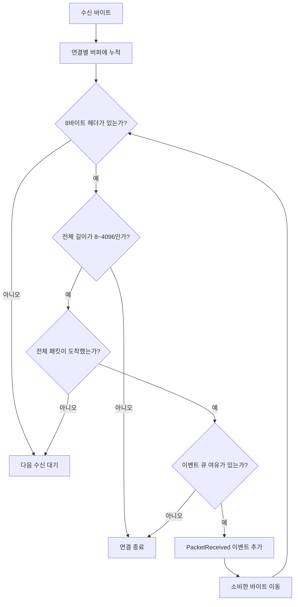

TCP 수신 한 번이 요청 하나와 같지는 않습니다. 나뉘어 도착한 패킷은 조립하고, 여러 패킷이 붙어 도착하면 각각 이벤트로 만듭니다. 수신 버퍼에 남은 미완성 바이트는 다음 수신에 이어 사용합니다.

| 헤더 필드 | 크기 | 의미 |
|---|---|---|
| 전체 길이 | 2바이트 | 헤더 포함, big-endian |
| 메시지 코드 | 1바이트 | 요청·응답·알림 종류 |
| 오류 코드 | 1바이트 | 정상 요청과 알림에서는 0 |
| requestId | 4바이트 | 요청·응답 대응, big-endian; 서버 알림은 0 |

### 요청 하나의 처리 단계

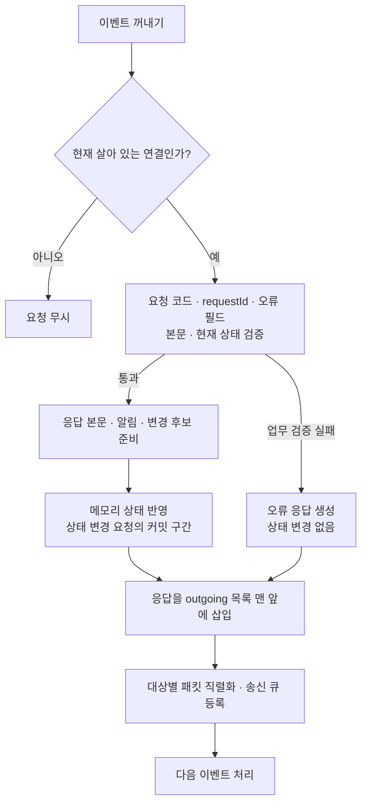

핵심 경계는 **상태 반영과 네트워크 전달이 분리되어 있다는 점**입니다. `GameWorld::HandleRequest`가 반환할 때 상태 변경은 이미 끝나 있습니다. 그 후 로직 워커가 응답과 알림을 순서대로 송신 요청합니다. Echo·Ping·Chat은 게임 상태를 변경하지 않습니다.

업무 검증 실패는 대응 응답 코드와 오류 필드로 돌려주며 본문은 비웁니다. 알 수 없는 요청 코드는 `ErrorResponse`입니다. 실행 중 예외는 로직 워커가 잡아 요청 연결의 종료·정리를 시도합니다. 예외 시의 세부 한계는 [실패 처리](#5-실패-처리와-보장-범위)에 설명합니다.

## 4. 요청별 트랜잭션

### 4.1 입장과 방 생성

| 단계 | Enter | CreateRoom |
|---|---|---|
| 검증 | 본문 파싱, `Session.userId=0`, 다음 ID 사용 가능 | 본문 파싱, 입장 완료, 방 없음, `Lobby`, 정원 1~16, 다음 방 ID 사용 가능 |
| 사전 준비 | 발급할 ID를 담은 응답 직렬화 | 생성자를 포함한 임시 방 구성, 전체 방 스냅샷 응답 직렬화 |
| 상태 반영 순서 | User 생성·플레이어→연결 인덱스 추가 → Session.userId 지정·카운터 증가 → `Lobby` | 방 맵에 삽입 → 세션 방 ID 지정·카운터 증가 → `InRoom` |
| 응답 | `EnterResponse(player_id)` | `CreateRoomResponse(room_id, capacity, player_ids)` |
| 알림 | 없음 | 없음: 생성자 자신은 스냅샷 응답으로 참가를 확인 |

응답 본문을 먼저 만들기 때문에 이 단계의 직렬화 실패는 아직 입장·방 생성 상태를 변경하지 않습니다. 커밋 이후의 출력 목록 생성·전송 실패까지 자동으로 되돌리는 구조는 아닙니다.

### 4.2 방 참가: 검증 → 복사본 준비 → 양쪽 상태 반영

예시: 방 10의 정원은 2명이고 A만 참가 중입니다. 로비의 B가 방 10에 참가합니다.

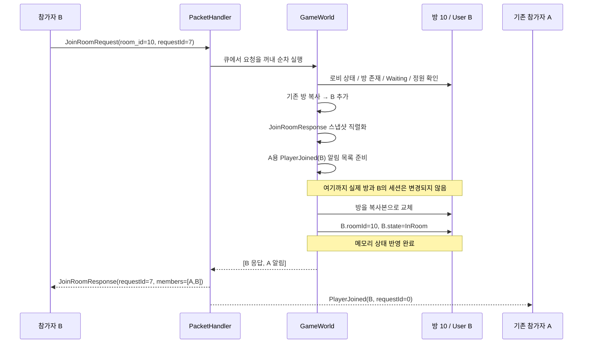

다이어그램의 서버→클라이언트 화살표는 **송신 요청 순서**입니다. 서로 다른 연결의 실제 수신 완료 시각까지 보장하지는 않습니다.

| 시점 | 방 참가자 | B User | 외부에 보낼 데이터 |
|---|---|---|---|
| 시작 | `{A}` | `Lobby`, 방 없음 | 없음 |
| 준비 완료 | 실제 방은 `{A}`, 복사본은 `{A,B}` | 그대로 | B의 전체 스냅샷, A의 참가 알림 |
| 상태 반영 완료 | `{A,B}` | `InRoom`, 방 10 | 아직 실제 전송 전 |
| 출력 처리 | `{A,B}` | `InRoom`, 방 10 | B 응답 먼저, 기존 참가자 알림 다음 |

`HandleRoomRequest`는 방 복사본과 응답·알림을 준비한 뒤 실제 방과 세션을 갱신합니다. 이 갱신 구간에는 다른 로직 이벤트가 끼어들지 않습니다. B에게 자기 자신의 `PlayerJoined`는 보내지 않으며, B는 응답의 참가자 목록을 기준으로 상태를 구성합니다.

#### 마지막 자리 경쟁

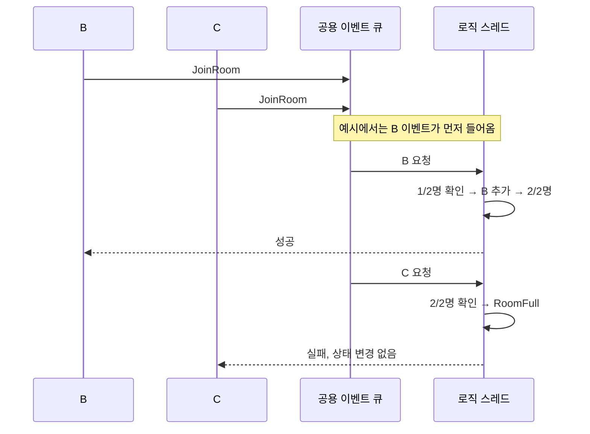

검사와 참가 반영을 한 로직 스레드가 연속 수행하므로 두 요청이 동시에 빈자리 하나를 차지하지 않습니다. C가 먼저 큐에 들어오면 결과가 반대가 됩니다. 다른 방의 요청도 현재는 같은 로직 스레드를 공유합니다.

### 4.3 방 퇴장과 연결 종료

두 경로는 `RemoveRoomMembership`을 공유합니다. 차이는 **명시적 퇴장은 세션을 로비로 남기고, 연결 종료는 User·Session과 플레이어 인덱스까지 삭제**한다는 점입니다.

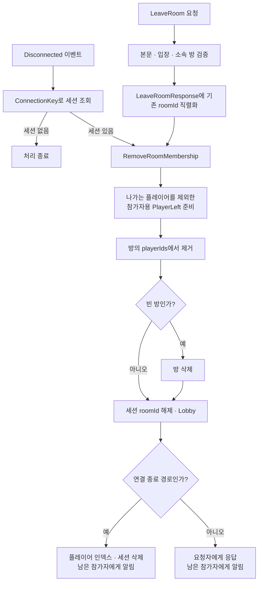

소속 방이 없으면 공통 방 정리는 즉시 반환합니다. 연결 종료에서는 그 뒤 세션 삭제를 계속합니다. 중복 연결 종료는 live 연결 집합과 세션 조회로 걸러, 정상 처리 후 동일한 퇴장 알림을 다시 만들지 않습니다.

연결 종료가 큐에 들어갈 때 해당 키를 live 집합에서 먼저 제거합니다. 아직 실행되지 않은 그 연결의 요청은 워커의 live 검사에서 무시됩니다. 이미 live 검사를 통과해 실행 중인 요청은 완료될 수 있고, 이후 종료 이벤트가 상태를 정리합니다.

### 4.4 채팅: 상태 확인과 방 전체 전달

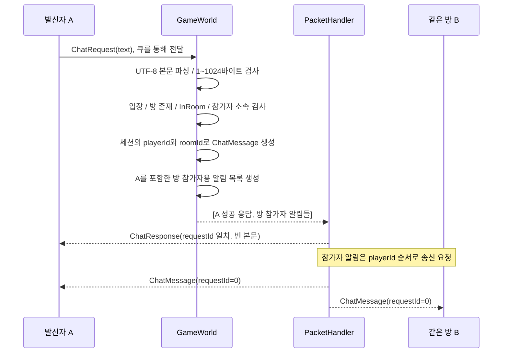

이 도식의 알림 순서는 A의 ID가 B보다 작은 예시입니다. 실제 목록은 방의 `std::set` 참가자 순서로 생성됩니다.

채팅은 세션·방을 변경하거나 채팅 내역을 저장하지 않습니다. 발신자 ID와 방 ID는 서버 세션에서 가져옵니다. 성공 응답은 서버가 요청을 받아 알림 목록을 만들었다는 뜻이며, 모든 참가자가 메시지를 받거나 읽었다는 확인은 아닙니다. 자신에게도 알림이 오므로 mockclient는 해당 알림으로 채팅을 표시합니다.

### 4.5 Echo와 Ping

Echo는 Protobuf의 `bytes data`를 보존하여 응답하고, Ping은 빈 본문을 검증하여 응답합니다. 둘 다 입장 전 사용 가능하며 게임 상태와 방 알림을 변경하지 않습니다. 정상 연결의 Ping 응답은 그 연결에 앞서 큐에 등록된 요청의 처리 순서를 확인하는 데 활용할 수 있지만, 모든 연결의 전달 완료를 확인하는 장벽은 아닙니다.

## 5. 실패 처리와 보장 범위

### 상태 반영 후 송신 실패

예시: A와 C가 있는 방에 B가 참가합니다. B의 참가 상태는 반영됐지만 A에게 참가 알림을 보내지 못했습니다.

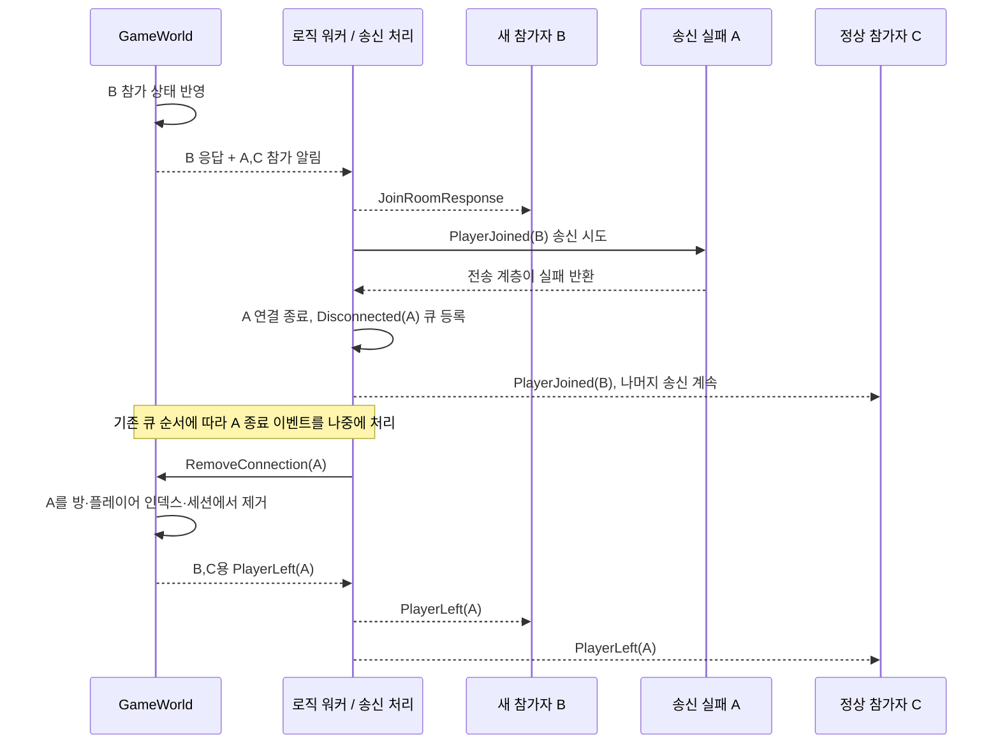

B의 참가를 취소하는 대신 실패한 A를 후속 이벤트로 정리합니다. A의 종료 이벤트 앞에 다른 이벤트가 있을 수 있으므로, 송신 실패 감지와 방 상태 정리는 동일한 순간에 일어나지 않습니다. 이미 live 집합에서 제거된 A로의 송신은 건너뜁니다.

요청자 B에게 성공 응답을 보내지 못한 경우에도 이미 반영한 참가를 즉시 롤백하지 않습니다. B의 연결 종료 이벤트가 후속 퇴장을 수행하며, 다른 참가자는 B의 참가 후 퇴장 알림을 볼 수 있습니다.

### 실패 위치에 따른 결과

| 실패 위치 | 처리 | 상태와 클라이언트 관찰 |
|---|---|---|
| 패킷 길이 오류·요청 큐 포화 | 해당 연결 종료 | 오류 응답 없이 끊길 수 있음. 후속 연결 종료 정리 |
| 본문·입장·정원 등 업무 검증 | 오류 응답 | 해당 요청의 게임 상태 변경 없음 |
| 변경 후보·응답·알림 준비 중 예외 | 요청 연결 종료 시도 | 아직 커밋 전인 해당 작업의 상태는 미반영. 이후 연결 정리로 기존 방 소속은 제거될 수 있음 |
| 상태 반영 후 출력 목록 삽입·직렬화 실패 | 요청 또는 송신 대상 연결 종료 시도 | 앞서 반영한 상태를 자동 롤백하지 않음 |
| 송신 큐 포화·송신 콜백 실패 | 실패한 수신 대상 종료, 다른 대상 송신 계속 | 부분 전달 가능, 실패 대상은 후속 이벤트로 정리 |
| 비동기 송신 완료에서 오류 발생 | IOCP에서 연결 종료 | 송신 큐 등록 성공 후에도 실제 전달이 실패할 수 있음 |
| 서버 Stop·프로세스 종료 | 메모리 상태 소멸 | 대기 작업·알림 전달 완료·재접속 복구를 보장하지 않음 |

### 어디까지 트랜잭션 성질이 있는가?

| 성질 | 현재 구현 |
|---|---|
| 동시 요청 격리 | 게임 상태를 한 로직 스레드만 변경. 이벤트 처리 중 다른 게임 요청이 끼어들지 않음 |
| 정상 경로의 일관성 | 방·세션의 상호 관계와 정원을 같은 처리 구간에서 갱신 |
| 원자성 | 업무 검증 및 사전 준비를 먼저 수행하지만, 모든 예외 위치에 대한 강한 원자성·롤백은 없음 |
| 내구성 | 메모리에만 저장. 재시작 시 방·세션·ID 카운터 초기화 |
| 전달 보장 | 연결별 송신 순서 유지. 전체 수신자에 대한 일괄 성공, 수신 확인, 재전송 로그는 없음 |
| 중복 요청 | `requestId`는 응답 매칭용. 서버 중복 제거·결과 캐시·exactly-once 처리 없음 |

예를 들어 `HandleRequest`는 상태 변경 후 응답을 출력 벡터 맨 앞에 삽입합니다. 여기서 메모리 할당 예외가 나면 상태는 이미 반영된 뒤입니다. 연결 정리 역시 알림 벡터 생성이나 이벤트 큐 삽입 중 예외가 날 수 있으므로, **자원 고갈을 포함한 모든 실패에서 복구가 완료된다고 보장할 수 없습니다**. 현재 코드는 일반적인 업무 오류와 연결 실패를 다루며 DB 수준의 ACID 트랜잭션 엔진은 구현하지 않습니다.

응답을 못 받았다고 같은 `requestId`로 재전송해도 서버는 기존 결과를 찾아주지 않습니다. 예를 들어 같은 채팅 요청을 다시 보내면 다시 방송될 수 있고, 성공한 참가 요청을 재전송하면 `AlreadyInRoom`을 받을 수 있습니다.

### 오래된 연결과 새 연결의 분리

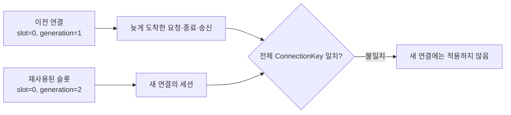

세션 조회에는 슬롯과 세대를 함께 사용합니다. 실제 `Send`·`Disconnect`도 연결 mutex 안에서 세대를 재검사합니다. 슬롯은 기존 I/O가 모두 완료된 후 재사용하므로 이전 세대의 이벤트가 새 연결을 끊거나 새 세션을 지우는 것을 방지합니다.

## 6. 용량과 종료 경계

| 항목 | 현재 값·정책 |
|---|---|
| 기본 포트 / 연결 슬롯 | 20000 / 1000 |
| 패킷 / 본문 | 최대 4096 / 4088바이트 |
| 채팅 / 방 정원 | UTF-8 1~1024바이트 / 1~16명 |
| 이벤트 큐 예산 | `대기 이벤트 수 + live 연결 수 ≤ 1024`. live 연결마다 종료 이벤트용 1자리 예약 |
| 새 연결 등록 | Connected 이벤트와 종료 예약을 합쳐 2자리 여유 필요 |
| 연결별 송신 큐 | 최대 256개, 진행 중인 송신 포함 |

기본 연결 슬롯 1000개가 곧 1000개의 동시 입장 이벤트를 무조건 수용한다는 뜻은 아닙니다. 이벤트 큐 예산이 별도로 적용됩니다. 종료 이벤트 예약은 논리적인 자리 확보이며 메모리 할당 성공까지 보장하지 않습니다.

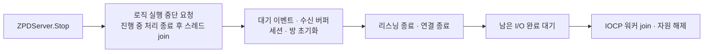

종료 과정은 모든 요청을 처리하거나 모든 퇴장 알림을 전달한 뒤 멈추는 방식이 아닙니다. 로직과 게임 상태를 먼저 정리하므로 재시작은 새로운 서버 상태에서 시작합니다.

## 7. 코드와 테스트로 확인하기

| 확인할 내용 | 구현 또는 기존 테스트 |
|---|---|
| 이벤트·틱 순차 실행·출력 순서·실패한 연결 정리 | [PacketHandler.cpp](../server/src/PacketHandler.cpp) |
| 입장·요청 분기·응답 ID 복사 | [GameWorld.cpp](../server/src/GameWorld.cpp) |
| 참가 복사본·상태 반영·공통 퇴장 경로 | [RoomRequests.cpp](../server/src/RoomRequests.cpp) |
| 발신자 포함 방 채팅 | [ChatRequests.cpp](../server/src/ChatRequests.cpp) |
| 송신 큐·부분 송신·연결 세대 | [ClientConnection.hpp](../server/include/ClientConnection.hpp), [IOCPServer.hpp](../server/include/IOCPServer.hpp) |
| 마지막 자리 경쟁, 오래된 세대, 중복 종료, 특정 수신자 실패 후 나머지 전달 | [server_tests.cpp](../server/tests/server_tests.cpp) |
| 실제 콘솔 클라이언트의 채팅·알림·종료·잘못된 응답 | [chat_client_tests.py](../mockclient/tests/chat_client_tests.py) |

저장소 루트에서 실행합니다.

```powershell
cmake --preset windows-x64
cmake --build --preset debug
ctest --preset debug
python mockclient/tests/chat_client_tests.py
```

위 테스트는 일반적인 요청·연결 실패 시나리오를 검증합니다. 모든 메모리 할당 지점의 예외나 패킷의 실제 수신·읽기 완료까지 보증하는 테스트는 아닙니다. 상세 필드·코드는 [MO 통신 규격](MO_통신_규격.md), 파일별 역할은 [코드 구조](코드_구조.md)를 참고하세요.
