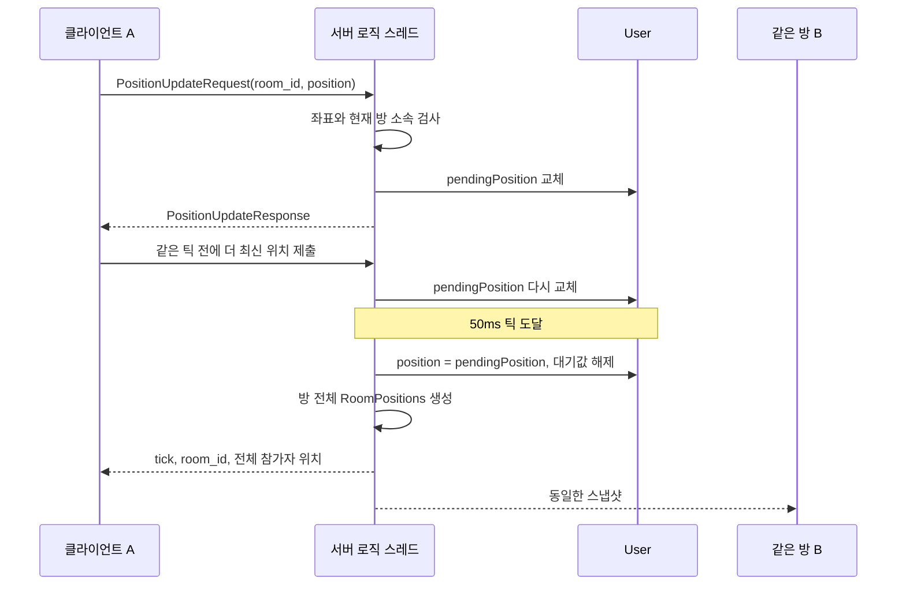

# 틱 기반 위치 동기화

서버는 기본 **20Hz / 50ms**로 방의 전체 위치 스냅샷을 전송합니다. 위치는 클라이언트가 제출하고 서버는 유효성·방 소속을 확인합니다. 현재 단계에는 이동 속도 제한, 충돌·물리 처리, 보간, 예측·보정이 없습니다.

## 처리 흐름



접수 응답은 대기 위치가 갱신됐다는 뜻입니다. 실제 반영은 틱에서 수행하며, 클라이언트는 `RoomPositions`로 반영된 결과를 확인합니다. 한 틱 사이에 여러 위치가 접수되면 마지막 요청 하나만 반영됩니다. requestId는 중복 제거용이 아닙니다.

## 통신 규격

스키마: [position.proto](../common/proto/position.proto). 숫자는 10진수입니다.

| 코드 | 메시지 | 필드 |
|---|---|---|
| 8 | PositionUpdateRequest | `uint64 room_id`, `Position position` |
| 136 | PositionUpdateResponse | 빈 본문, 요청의 requestId를 복사 |
| 196 | RoomPositions | `uint64 room_id`, `uint64 tick`, `repeated PlayerPosition players` |

`Position`은 `float x, y, z`, `PlayerPosition`은 `uint64 player_id, Position position`입니다. 좌표 단위·원점은 게임에서 일관되게 정해야 합니다. 요청에는 position 메시지가 반드시 있어야 하며 `(0,0,0)`은 유효합니다. 각 축은 유한한 값이며 **-1000000~1000000** 범위입니다.

| 오류 | 조건 |
|---|---|
| InvalidPayload | 파싱 실패, position 누락, room_id 0, NaN·무한대·범위 초과 |
| NotEntered | 입장 전 위치 제출 |
| NotInRoom | 로비에서 위치 제출 |
| InvalidState | 현재 방과 요청 방 ID 불일치 또는 세션·방 소속 불일치 |

스냅샷은 자신을 포함한 현재 방 참가자 전원에게 전송하며, 다른 방·로비에는 전송하지 않습니다. `requestId=0`, `error=0`입니다. 참가자 목록은 playerId 순서이고 매 틱 전체 목록을 담습니다. 움직이지 않아도 반복 전송합니다. 최대 16명으로 기존 4096바이트 패킷 제한 안에 들어갑니다.

## 틱과 상태 수명

- 틱 번호는 서버 GameWorld 전체에서 증가하며 실행된 틱마다 1씩 증가합니다. 재시작하면 초기화됩니다. 실제 시각이나 클라이언트 요청 번호가 아닙니다.
- `steady_clock`의 마감 시각으로 대기하므로 요청이 없어도 틱을 실행합니다. 이벤트 하나가 끝날 때마다 마감을 검사해 요청이 계속 있어도 틱을 수행합니다.
- 틱과 방 요청은 같은 로직 스레드에서 실행합니다. 틱 중간에 참가·퇴장 요청이 끼어들지 않습니다.
- 작업이 지연되면 놓친 틱을 무제한 따라잡지 않습니다. 과부하에서는 실제 빈도가 20Hz보다 낮아질 수 있습니다.
- 방 생성·참가 시 위치는 `(0,0,0)`이고 다음 틱에 전달됩니다. 참가 응답과 PlayerJoined가 해당 연결의 위치 스냅샷보다 먼저 송신 큐에 들어갑니다.
- 퇴장 시 현재·대기 위치를 초기화합니다. 재참가해도 이전 위치가 남지 않습니다. 연결 종료 정리가 완료되면 이후 스냅샷에서 제외됩니다.
- 전송 실패 시 기존 정책대로 실패 대상 연결을 정리합니다. 이미 반영한 위치는 롤백하지 않으며 다른 대상 전송은 계속합니다.

## 직접 테스트

서버와 mockclient 두 개를 실행하고, 두 클라이언트가 `/enter` 후 같은 방에 참가하도록 합니다.

```text
/move 10 -2 3
/positions
```

`/move`에는 절대 위치를 입력합니다. 서버 접수 시 `Position accepted for next tick.`이 출력되고, 다음 틱에서 두 클라이언트 모두 `Player <ID> position: 10 -2 3`을 표시합니다. `/positions`는 마지막 수신 틱과 위치 목록을 보여줍니다. 초기 위치 또는 변경된 위치만 자동 출력하므로 정지 중에는 콘솔이 반복 출력으로 채워지지 않습니다.

자동 테스트는 기존 명령에 통합했습니다.

```powershell
cmake --build --preset debug
ctest --preset debug
python mockclient/tests/chat_client_tests.py
```

테스트는 마지막 위치 병합, 잘못된 좌표, 다른 방 ID, 방 격리, 재참가 초기화, 연결 종료 제거, 최대 정원 스냅샷 크기, 유휴·연속 요청 중 틱 실행, 실제 두 클라이언트 사이의 전달을 검사합니다.

Unity에서는 새 스키마로 C#을 재생성하고 코드 196을 수신 처리해야 합니다. 기존 클라이언트도 방에 들어가면 새 알림을 받으므로 프로토콜 업데이트가 필요합니다. 위치 표시를 부드럽게 만드는 보간은 후속 클라이언트 작업입니다.

게임 확장 이후에는 대기 위치 반영 → GameLogic.OnTick → 전체 위치 스냅샷 순서입니다. 게임의 AcceptPosition으로 클라이언트 위치를 거절하거나, OnTick에서 GameContext.SetPosition으로 서버 위치를 결정할 수 있습니다.
